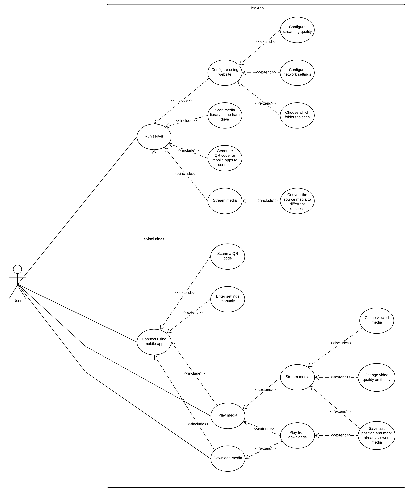
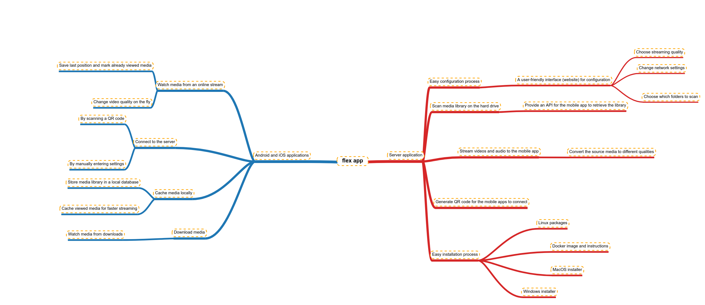

# Flex Server

## What is Flex Server?

Flex Server is an application used for synchronization and streaming your media library to other devices.

### Use case diagram

### Mind map diagram

## Requirements

### Android 

- Android 6 (Marshmallow) or newer version
- Optional: camera scan permission to scan QR code.

### iOS

- iOS 9.X or newer version
- Optional: camera scan permission to scan QR code.

### PC (Server)

- Windows 10, macOS or recent GNU/Linux distro

### Network

At least one of the following should be true to use application

- Server has public ip address
- Client is in the same network with server

## Target audience

Target audience are people who download movies or series to watch them later on their mobile devices.
